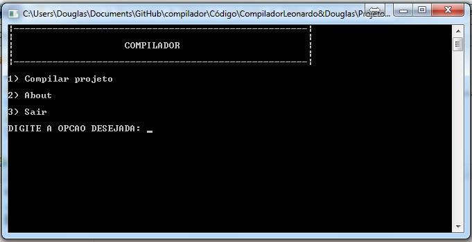
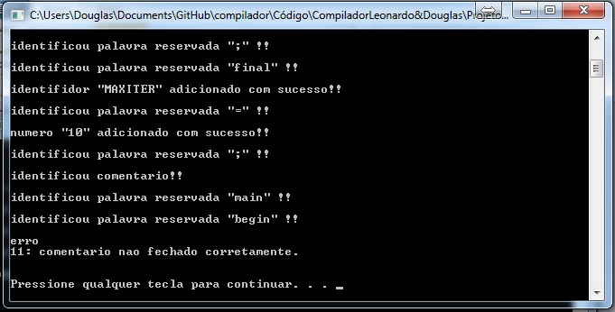

compilador
==========
Trabalho desenvolvido na disciplina de compiladores no curso de Ciência da Computação na Universidade de Itaúna.

O objetivo do trabalho era por em prática a construção de um analisador léxico e sintético, a especificação do trabalho pode ser encontrado nos arquivos.

Abaixo alguns screenshots

